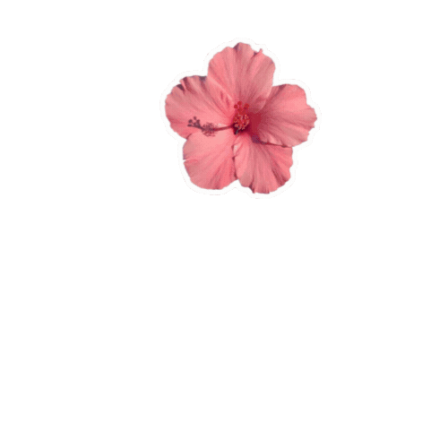

  

 

 

## 01 · About

Hi, I'm **Uzma** 👋 — an aspiring Software Engineer and MCA student building full-stack web applications with the **MERN stack**.

- 🌱 Pursuing my **MCA**, sharpening my skills in **React.js, Node.js, Express.js & MongoDB**
- 🛠️ Also comfortable with **Python** and **Selenium** for automation & testing
- 🚀 Open to **Internships & Full-Time Opportunities**
- 📫 Fun fact: **YOUR_FUN_FACT_HERE**

 

## 02 · Toolbox

  

 

## 03 · Activity

 

<picture>
  <source media="(prefers-color-scheme: dark)" srcset="https://raw.githubusercontent.com/UzmaNoorulain/UzmaNoorulain/output/snake-dark.svg">
  <source media="(prefers-color-scheme: light)" srcset="https://raw.githubusercontent.com/UzmaNoorulain/UzmaNoorulain/output/snake.svg">
  
</picture>

 

<table>
  <tr>
    <td width="50%" align="center"></td>
    <td width="50%" align="center"></td>
  </tr>
</table>

 

## 04 · Projects

| Project | What it does | Link |
| :--- | :--- | :---: |
| **webAPI** | Web API project built with JavaScript | [View Repo](https://github.com/UzmaNoorulain/webAPI) |
| **Todo App** | Task management app with add, update, delete — CRUD & state management practice | [View Repo](https://github.com/UzmaNoorulain/todo_app_flutter) |
| **Weather App UI** | App UI for displaying weather info with dynamic icons & backgrounds | [View Repo](https://github.com/UzmaNoorulain/wheatherApp_UI_flutter) |
| **Login Page UI** | Login page built with core UI widgets (TextField, Button, AppBar) | [View Repo](https://github.com/UzmaNoorulain/login_page_UI_flutter) |
| **Selenium With Python** | Browser automation & testing scripts using Selenium | [View Repo](https://github.com/UzmaNoorulain/Selenium_With_Python) |
| **Snake Game** | Classic Snake game built in Python | [View Repo](https://github.com/UzmaNoorulain/Snake_game) |

## 05 · Let's talk

Open to internships, full-time roles, and collaborations. The fastest way to reach me is [email](mailto:YOUR_EMAIL_HERE@gmail.com) or [LinkedIn](https://www.linkedin.com/in/uzma-noorulain-shaikh/).
